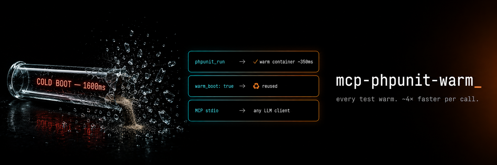

<p align="center">
  
</p>

# mcp-phpunit-warm

> **Stop paying PHPUnit's bootstrap tax on every test call.**
> A warm-process [MCP](https://modelcontextprotocol.io/) server that keeps [PHPUnit](https://phpunit.de/) bootstrapped across calls. **~6× faster per call** vs cold CLI. Works with every MCP client.
>
> **v0.4.0:** each test run executes in a short-lived **forked child**, so an edit made between calls is always picked up — no more stale results from a class the warm process loaded earlier. The framework stays warm; only your code is re-read.
>
> **v0.2.0:** results captured in-memory via `EventFacade` subscribers — no more JUnit XML round-trip.

[](https://github.com/Digital-Process-Tools/mcp-phpunit-warm/actions/workflows/tests.yml)
[](https://packagist.org/packages/dpt/mcp-phpunit-warm)
[](https://www.php.net/)
[](LICENSE)

[Why](#why) • [Install](#install) • [Use it](#use-it) • [Benchmark](#benchmark) • [Compatibility](#compatibility) • [Tools exposed](#tools-exposed) • [How it works](#how-it-works) • [FAQ](#faq) • [Credits](#credits)

---

## Why

[PHPUnit](https://phpunit.de/) is the standard testing framework for PHP. It is also slow to **start**.

Every `phpunit` invocation pays the same toll: autoloader bootstrap, XML config parsing, test suite construction, extension bootstrapping. For agents and validators that run PHPUnit after every edit or after every MCP tool call, that cold-start cost adds up fast.

`mcp-phpunit-warm` keeps a long-lived PHP process with PHPUnit already bootstrapped. **The boot is paid once; every call inherits that warm framework via a fork and skips re-parsing it.** Your own source and test classes are re-read on each call (in the forked child) so an edit is never missed — you get the boot savings without the staleness.

## Install

```bash
composer global require dpt/mcp-phpunit-warm
```

Makes `mcp-phpunit-warm` available on `$PATH`.

Requires PHP 8.2+. Pulls PHPUnit ^10 || ^11 || ^12 as a real Composer dep.

## Use it

### Claude Desktop

Edit `~/Library/Application Support/Claude/claude_desktop_config.json` (macOS) or `%APPDATA%\Claude\claude_desktop_config.json` (Windows):

```json
{
  "mcpServers": {
    "phpunit": {
      "command": "mcp-phpunit-warm",
      "args": [
        "--working-dir=/path/to/your/project",
        "--config=/path/to/your/project/phpunit.xml"
      ]
    }
  }
}
```

Restart Claude. Ask: *"Run the tests for UserServiceTest"*.

### Cline / Continue / Cursor / Zed / any MCP client

Same `command` + `args` shape. The server speaks plain MCP over stdio — no client-specific glue.

### Standalone

```bash
mcp-phpunit-warm --working-dir=/path/to/project --config=/path/to/project/phpunit.xml
```

Reads MCP JSON-RPC on stdin, writes responses on stdout.

## Benchmark

Measured on a real DVSI codebase, single-test invocations:

| Setup | Per call (steady-state) |
|-------|--------------------------|
| `vendor/bin/phpunit` (fresh CLI each call) | ~1600ms |
| **mcp-phpunit-warm (daemon warm)** | **~300ms** |

First call into a fresh daemon pays the boot once (~1400ms). All subsequent calls reuse the warm autoloader and singletons.

Results are captured in-memory via `PHPUnit\Event\Facade` subscribers — no JUnit XML temp file, no per-call printer setup.

The win is cold-start amortization: autoloader bootstrap, XML config parsing, and test suite construction happen once. Subsequent calls skip all of it. Smaller win than [mcp-rector-warm](https://github.com/Digital-Process-Tools/mcp-rector-warm) (~14× per edit) because PHPUnit cold is already faster than Rector cold.

## Compatibility

| Client | Status |
|--------|--------|
| Claude Desktop | ✅ stdio MCP |
| Cline (VS Code) | ✅ stdio MCP |
| Continue (VS Code / JetBrains) | ✅ stdio MCP |
| Cursor | ✅ stdio MCP |
| Zed | ✅ stdio MCP |
| Custom (Python/Node/Go MCP clients) | ✅ standard protocol |

| PHPUnit | Status |
|---------|--------|
| ^10 | ✅ tested |
| ^11 | ✅ tested |
| ^12 | ✅ tested |

## Tools exposed

### `phpunit_run`

Run PHPUnit tests.

| Argument | Type | Default | Description |
|----------|------|---------|-------------|
| `testFile` | string\|null | `null` | Absolute path to a test file or directory. Omit to run the full suite. |
| `filter` | string\|null | `null` | `--filter` pattern to run specific tests |
| `group` | string\|null | `null` | `--group` name to restrict execution |

Returns:

```json
{
  "exit_code": 0,
  "output": "{\"tests\":3,\"assertions\":5,\"failures\":[],\"errors\":[],\"skipped\":[],\"time\":0.012}",
  "warm_boot": true
}
```

`warm_boot: true` ⇒ a previous run already warmed this daemon (the forked child inherits the warm framework). `false` ⇒ first call on this daemon.

`output` is a JSON string with `{tests, assertions, failures: [{class, method, file, line, message}], errors: […], skipped: […], time}`. Captured in-process via `PHPUnit\Event\Facade` subscribers — no temp file, no XML parse.

## How it works

Four decisions worth knowing:

1. **One daemon per project, not per call.** Config + working dir pin at server startup via `--config` and `--working-dir`. The PHPUnit framework stays bootstrapped for the daemon's whole life.

2. **Fork per call — warm framework, fresh code.** A long-lived PHP process can never reload a class once it's autoloaded (PHP forbids redeclaration), so an in-process warm runner would keep executing the *first* version of every class it ever loaded and silently ignore your edits. Instead, the daemon parent boots only the framework and *never loads a user source/test class*; each `phpunit_run` **forks a child** that autoloads your classes fresh from disk, runs them, ships the result back over a socket, and dies. The child inherits the parent's compiled framework via copy-on-write (warm) yet sees the current code every time (fresh). The child `SIGKILL`s itself once its result is on the wire so no teardown hook can write to the parent's stdio channel. On a platform without `pcntl` the daemon falls back to in-process execution (warm but stale-after-edit).

3. **Static singleton reset before each run.** PHPUnit 10/11/12 uses sealed singletons (`EventFacade`, `Registry`, `OutputFacade`, `CodeCoverage`) that are reset via Reflection before a run, so `Application::run()` can be invoked without hitting `EventFacadeIsSealedException` — needed in the prewarm probe and the fork-less fallback.

4. **In-memory results via `EventFacade` subscribers.** PHPUnit's `DefaultPrinter` writes to `php://stdout` using `fwrite()`, which bypasses PHP's output buffer and would corrupt the MCP stdio transport. We force `--no-output` to silence the printer, then register subscribers on `PHPUnit\Event\Facade` (`PreparedSubscriber`, `FailedSubscriber`, `ErroredSubscriber`, …) that collect results in memory during the run. No temp file. No XML round-trip.

## FAQ

**Does this replace `vendor/bin/phpunit`?** No. Use it from MCP clients (Claude Desktop, agents). For one-off CLI runs the regular binary is simpler.

**Why JSON output instead of JUnit XML?** v0.1 used JUnit XML via `--log-junit` to a temp file. v0.2 captures results in-memory via `EventFacade` subscribers and serializes to JSON — no file I/O, no XML parse, smaller payload. The shape mirrors what JUnit XML had, just easier for agents to consume.

**Does it support `--filter`?** Yes — pass `filter: "testMyMethod"` as an argument to the tool.

**Do I lose the warm speedup if every call forks?** No. The fork is cheap (copy-on-write) and the child inherits the parent's already-compiled PHPUnit framework, so it skips the framework boot. The only per-call cost is re-reading *your* source/test classes — which is exactly what makes the result trustworthy after an edit.

**What if I edit a file between two calls?** The next call sees it. Each run executes in a fresh forked child that autoloads your classes from disk, so there's no stale-class problem (the bug that motivated v0.4.0: [claude-supertool#265](https://github.com/Digital-Process-Tools/claude-supertool/issues/265)). **One caveat:** classes loaded by your `phpunit.xml` *bootstrap* itself (e.g. a bootstrap that eagerly `require`s application classes) are loaded into the long-lived parent and inherited by every forked child — so edits to *those* specific classes won't be picked up until the daemon restarts. Lazy autoloaders (the common case) are unaffected; keep heavy eager-loading out of the bootstrap.

**`--prewarm` flag?** On by default now. At startup the daemon runs a single bundled throwaway probe test through your config under `--no-output` — that fires the `phpunit.xml` bootstrap and loads the framework (which forked calls then inherit) **without** loading any of your classes and without dumping to `php://stdout`. The old `--list-tests` prewarm was opt-in precisely because large suites flooded stdout and corrupted the MCP transport; the probe avoids that. Disable with `--no-prewarm`.

**Memory?** The daemon sets `memory_limit = -1`. Idle daemon ≈ 30–60 MB resident depending on project bootstrap.

**Does it survive PHPUnit version updates?** The static reset targets known property names. If PHPUnit renames a singleton property in a future version, the reset skips it silently (caught via `ReflectionException`) and the run may fail with a sealed-facade error. Pin PHPUnit in your own `composer.json` if you need determinism.

**Alpha status?** The `warm_boot: true` guarantee is verified by the integration test suite. That said, PHPUnit internals (`@internal`) can change — treat this as beta until PHPUnit 11/12 compatibility is confirmed in CI.

## Credits

- **[PHPUnit](https://phpunit.de/)** by [Sebastian Bergmann](https://sebastian-bergmann.de/) and contributors — the engine doing all the real work. If you ship PHP, [sponsor him](https://github.com/sponsors/sebastianbergmann).
- **[Model Context Protocol](https://modelcontextprotocol.io/)** by Anthropic — the protocol that makes this kind of tool integration possible.
- **[mcp/sdk](https://github.com/modelcontextprotocol/php-sdk)** — official PHP SDK, used here for stdio transport + tool discovery.

## Related

- **[PHPUnit docs](https://docs.phpunit.de/)** — configuration, assertions, extensions.
- **[PHPUnit on Packagist](https://packagist.org/packages/phpunit/phpunit)** — the upstream package.
- **[mcp-rector-warm](https://github.com/Digital-Process-Tools/mcp-rector-warm)** — same warm-process pattern for Rector refactoring.
- **[claude-supertool](https://github.com/Digital-Process-Tools/claude-supertool)** — DPT's batched-ops Claude Code companion.

## License

Community License — see [LICENSE](LICENSE). Built by [Digital Process Tools](https://github.com/Digital-Process-Tools).
